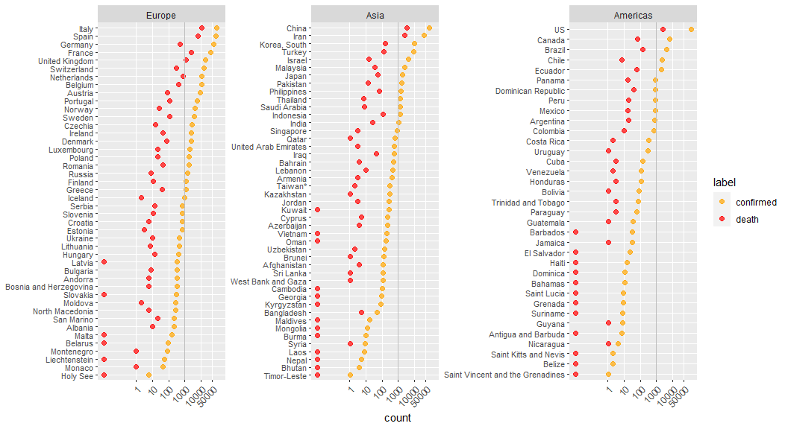
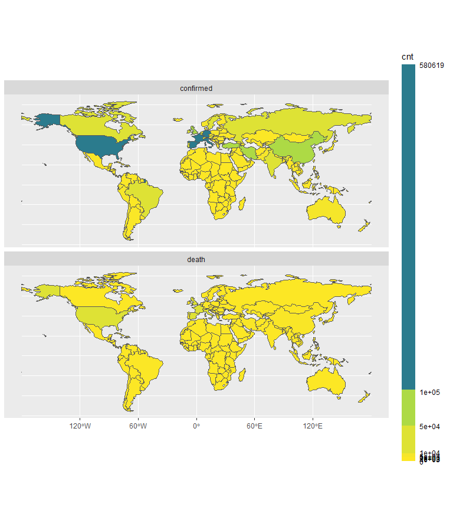
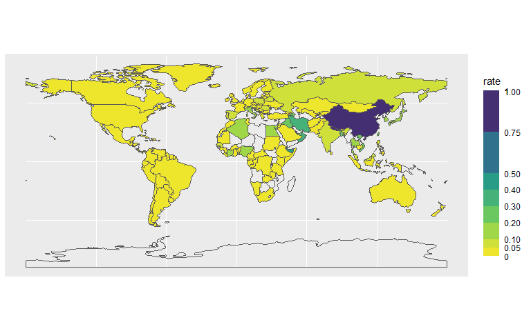

------------------------------------------------------------------------

> Note that the plots were last updated on March 18, 2020. They may be
> outdated by the time you read this.

Data prep
---------

``` r
library(readr)
library(dplyr)
library(tidyr)
library(lubridate)
library(ggplot2)
library(countrycode) # Adds continent data

# Pull data from Johns Hopkins Github site
conf  <- read_csv("https://raw.githubusercontent.com/CSSEGISandData/COVID-19/master/csse_covid_19_data/csse_covid_19_time_series/time_series_19-covid-Confirmed.csv")
death <- read_csv("https://raw.githubusercontent.com/CSSEGISandData/COVID-19/master/csse_covid_19_data/csse_covid_19_time_series/time_series_19-covid-Deaths.csv")
recov <- read_csv("https://raw.githubusercontent.com/CSSEGISandData/COVID-19/master/csse_covid_19_data/csse_covid_19_time_series/time_series_19-covid-Recovered.csv")

# Process the data into a tidy table
conf1  <- conf %>% 
  pivot_longer(names_to = "Date", values_to = "Counts", cols = -(1:4) ) %>% 
  mutate(Date = mdy(Date),
         label = "confirmed")

death1 <- death %>% 
  pivot_longer(names_to = "Date", values_to = "Counts", cols = -(1:4) ) %>% 
  mutate(Date = mdy(Date),
         label = "death")

recov1  <- recov %>% 
  pivot_longer(names_to = "Date", values_to = "Counts", cols = -(1:4) ) %>% 
  mutate(Date = mdy(Date),
         label = "recovered")

dat <- bind_rows(conf1, death1, recov1) %>% 
  rename(country = `Country/Region`) %>% 
  mutate(label = factor(label, levels = c("confirmed", "recovered", "death")))


# Add continent and iso code to the data
dat$continent <- countrycode(dat$country, 'country.name', 'continent')
dat$iso <- countrycode(dat$country, 'country.name', 'iso3c')
```

``` r
# Dot plot faceted by continent (limit to three continents for sake of fig size)
# (also: bumping count by small amount to apply log transformation)
dat %>% filter(Date == max(Date),
               !continent %in% c("Africa", "Oceania")) %>% 
  group_by(country, label) %>% 
  summarize(count = sum(Counts), continent = max(continent)) %>% 
  na.omit() %>% 
  ggplot() + aes(y = reorder(country, count, max), x = count + 0.01, col = label) + geom_point()+ 
  facet_wrap(~ reorder(continent, -count, median), scales = "free_y", ncol = 3) +
  theme(axis.text.y = element_text(size = 8),
        axis.text.x = element_text(angle = 45,  hjust = 1),
        panel.grid.minor = element_blank()) +
  scale_color_brewer(type = "qual") +
  scale_x_continuous(breaks = c(1, 10, 100, 1000, 10000, 50000)) +
  coord_trans( x = "log") +
  xlab("count") +
  ylab(NULL)+
  geom_vline(xintercept = 1000, col = "grey")
```



Choropleth map of counts
------------------------

``` r
library(sf)
library(rnaturalearth)


world <- ne_countries(scale = "small", returnclass = "sf") %>% 
  select(admin, iso_a3 )

dat2 <- dat %>% 
  filter(Date == max(Date)) %>% 
  group_by(iso, label) %>% 
  summarise(cnt = sum(Counts)) 

world2 <- world %>% 
  left_join(dat2, by = c("iso_a3" = "iso")) %>% 
  na.omit()

ggplot(world2) + geom_sf(aes(fill = cnt)) +
  scale_fill_binned(#low="#FFFFCC", high="#800026", 
    direction = -1,
    type = "viridis",
    breaks = c(1000, 2000, 3000, 5000, 10000, 50000, 100000),
    guide = guide_coloursteps(even.steps = FALSE, 
                              show.limits = TRUE,
                              ticks.linewidth = 2,
                              barheight = unit(7, "in"))) +
    facet_wrap(~ label, ncol = 1)
```



Choropleth map of recovery rates
--------------------------------

``` r
dat3 <- dat2 %>% 
  filter(label %in% c("confirmed", "recovered")) %>% 
  pivot_wider(names_from = label, values_from = cnt) %>% 
  mutate(rate = recovered / confirmed)

world3 <- world %>% 
  left_join(dat3, by = c("iso_a3" = "iso")) 

ggplot(world3) + geom_sf(aes(fill = rate)) +
  scale_fill_binned(#low="#FFFFCC", high="#800026", 
    direction = -1,
    type = "viridis",
    breaks = c(0.05, 0.1, 0.2, 0.3, 0.4, 0.5, 0.75, 1),
    guide = guide_coloursteps(even.steps = FALSE, 
                              show.limits = TRUE,
                              ticks.linewidth = 2,
                              barheight = unit(2.5, "in"))) 
```


